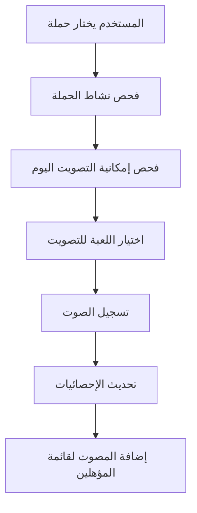

# 🎮 BAG Guild - نظام التصويت للألعاب

<div align="center">


**نظام تصويت ذكي وعادل للألعاب مع آلية سحب يومية**

[](https://soliditylang.org/)
[](https://openzeppelin.com/)
[](https://opensource.org/licenses/MIT)

**العربية** | [English](README.md)

</div>

## 🌟 حول BAG Guild

**BAG Guild** هي منظمة رائدة في مجال الألعاب والتقنيات اللامركزية، تهدف إلى بناء مجتمع متطور من اللاعبين والمطورين. نؤمن بقوة التكنولوجيا في تطوير صناعة الألعاب وخلق تجارب فريدة للمستخدمين.

### 🎯 رؤيتنا
- **الشفافية**: نظام تصويت شفاف ومفتوح المصدر
- **العدالة**: آلية سحب عادلة مرجحة حسب المشاركة
- **المجتمع**: بناء مجتمع قوي من محبي الألعاب
- **الابتكار**: استخدام أحدث التقنيات في البلوك تشين

## 🚀 عن المشروع

### 📋 الوصف

هذا المشروع هو **نظام تصويت ذكي للألعاب** مبني على تقنية البلوك تشين، يتيح للمستخدمين:

- 🗳️ **التصويت اليومي**: تصويت واحد يومياً لكل حملة
- 🎮 **حملات الألعاب**: إنشاء حملات تصويت متعددة الألعاب
- 🎁 **سحب الجوائز**: نظام سحب عادل مرجح حسب عدد الأصوات
- 📊 **تتبع شفاف**: تتبع كامل لجميع الأصوات والنتائج
- 🔒 **الأمان**: استخدام معايير OpenZeppelin للأمان

### 🛠️ التقنيات المستخدمة

- **Solidity ^0.8.22** - لغة البرمجة للعقود الذكية
- **OpenZeppelin Upgradeable** - معايير الأمان والقابلية للترقية
- **UUPS Proxy Pattern** - نمط الترقية الآمنة
- **NatSpec Documentation** - توثيق شامل للكود

## 🏗️ معمارية النظام

### 📦 المكونات الأساسية

```
🎮 إدارة الألعاب
├── إضافة الألعاب
├── تحديث معلومات الألعاب  
└── إدارة أنواع الجوائز

🗳️ إدارة الحملات  
├── إنشاء حملات التصويت
├── إدارة فترات الحملات
└── ربط الألعاب بالجوائز

👥 نظام التصويت
├── التصويت اليومي
├── تتبع المصوتين
└── منع التصويت المتكرر

🎁 اختيار الفائزين
├── تحديد اللعبة الفائزة
├── السحب العشوائي المرجح
└── إعلان النتائج
```

### 🔄 آلية التصويت



## 📱 كيفية الاستخدام

### 👑 للمشرفين

```solidity
// إضافة لعبة جديدة
addGame("اسم اللعبة", "الوصف", "رابط الصورة", "رابط البانر", PrizeType.CASH);

// إنشاء حملة تصويت
createVotingCampaign(
    "اسم الحملة",
    "وصف الحملة", 
    [1, 2, 3], // معرفات الألعاب
    ["جائزة 1", "جائزة 2", "جائزة 3"], // الجوائز
    startTime,
    endTime
);

// سحب الفائزين بعد انتهاء الحملة
drawWinners(campaignId, numberOfWinners);
```

### 👤 للمستخدمين

```solidity
// التصويت للعبة في حملة
voteForGame(campaignId, gameId);

// فحص إمكانية التصويت اليوم
canVoteToday(userAddress, campaignId);

// عرض إجمالي الأصوات
getUserTotalVotes(userAddress, campaignId);
```

### 📊 للاستعلامات

```solidity
// عرض تفاصيل الحملة
getCampaign(campaignId);

// عرض الحملات النشطة
getActiveCampaigns();

// عرض الفائزين
getCampaignWinners(campaignId);
```

## 🎲 نظام السحب العشوائي

### ⚖️ الآلية المرجحة

النظام يستخدم **سحب عشوائي مرجح** حيث:

- 🔢 **أصوات أكثر = حظ أكبر**: كل صوت إضافي يزيد من احتمالية الفوز
- 🎯 **عدالة مطلقة**: لا يمكن التلاعب بالنتائج
- 🔄 **عدم التكرار**: لا يمكن للفائز أن يفوز مرتين في نفس السحب

**مثال**: إذا صوت أحمد 5 مرات وصوت علي مرة واحدة:
- حظ أحمد في الفوز = 5/6 (83.33%)
- حظ علي في الفوز = 1/6 (16.67%)

### 🔒 الأمان

```solidity
// استخدام pseudo-random آمن (للتطوير)
generateRandomNumber(totalWeightedVotes, nonce);

// للإنتاج: يُنصح باستخدام Chainlink VRF
```

## 📈 الميزات المتقدمة

### 🕐 التصويت اليومي
- ✅ تصويت واحد يومياً لكل مستخدم في كل حملة
- ⏰ حساب الأيام بناءً على Unix timestamp
- 📅 تتبع آخر يوم تصويت لكل مستخدم

### 📊 تتبع شامل
- 👥 قائمة بجميع المصوتين لكل لعبة
- 📈 إحصائيات مفصلة لكل مستخدم
- 🎯 تتبع الأصوات لكل لعبة في كل حملة

### 🔄 قابلية الترقية
- 🛡️ UUPS Proxy Pattern للترقيات الآمنة
- 🔒 حماية من الترقيات غير المصرح بها
- 📝 توثيق كامل لكل إصدار

## 🔧 التثبيت والتشغيل

### 📋 المتطلبات

```bash
# Node.js & npm
node --version  # >= 16.0.0
npm --version   # >= 8.0.0

# Hardhat
npm install --global hardhat
```

### ⚙️ التثبيت

```bash
# استنساخ المشروع
git clone https://github.com/BAGGuild/game-voting-system.git
cd game-voting-system

# تثبيت التبعيات
npm install

# إعداد متغيرات البيئة
cp .env.example .env
# قم بتعديل .env مع قيمك الخاصة
```

### 🚀 النشر

```bash
# ترجمة العقود
npx hardhat compile

# تشغيل الاختبارات
npx hardhat test

# النشر على الشبكة المحلية
npx hardhat run scripts/deploy.js --network localhost

# النشر على Sepolia Testnet
npx hardhat run scripts/deploy.js --network sepolia
```

## 🧪 الاختبارات

```bash
# تشغيل جميع الاختبارات
npx hardhat test

# اختبارات مع تغطية الكود
npx hardhat coverage

# اختبارات الغاز
npx hardhat test --gas-reporter
```

## 📚 التوثيق

### 📖 توثيق NatSpec
العقد مزود بتوثيق شامل باستخدام NatSpec:

```solidity
/**
 * @title GameVoting
 * @dev عقد ذكي لإدارة حملات التصويت للألعاب
 * @notice يتيح هذا العقد للمستخدمين التصويت للألعاب في الحملات
 * @author فريق BAG Guild
 */
```

### 🔍 فحص العقد

يمكن فحص العقد على:
- **Etherscan**: للشبكة الرئيسية
- **Sepolia Etherscan**: لشبكة الاختبار

## 🤝 المساهمة

نحن نرحب بمساهماتكم! 🎉

### 📝 كيفية المساهمة

1. **Fork** المشروع
2. إنشاء **branch** جديد للميزة (`git checkout -b feature/AmazingFeature`)
3. **Commit** التغييرات (`git commit -m 'Add some AmazingFeature'`)
4. **Push** إلى Branch (`git push origin feature/AmazingFeature`)
5. فتح **Pull Request**

### 🐛 الإبلاغ عن الأخطاء

يرجى استخدام [GitHub Issues](https://github.com/BAGGuild/contracts/issues) للإبلاغ عن:
- 🐞 الأخطاء والمشاكل
- 💡 اقتراحات التحسين
- 🔧 طلبات الميزات الجديدة

## 🛡️ الأمان

### 🔒 معايير الأمان
- ✅ عقود OpenZeppelin
- ✅ التحكم في الوصول
- ✅ حماية من Reentrancy
- ✅ عمليات رياضية آمنة

### 🚨 تقرير الثغرات

إذا وجدت ثغرة أمنية، يرجى عدم فتح issue عام. بدلاً من ذلك:
- 📧 راسلنا على: security@bagguild.com
- 🔐 استخدم PGP للتشفير إذا أمكن

## 📄 الترخيص

هذا المشروع مرخص تحت رخصة MIT - انظر ملف [LICENSE](LICENSE) للتفاصيل.

```
رخصة MIT

حقوق النشر (c) 2025 BAG Guild

يُمنح بموجب هذا، مجاناً، لأي شخص يحصل على نسخة
من هذا البرنامج وملفات التوثيق المرتبطة ("البرنامج")، التعامل
في البرنامج دون قيود...
```

## 🌐 الروابط المهمة

- 🏠 **الموقع الرسمي**: [https://bagguild.com](https://bagguild.com)
- 📱 **التطبيق**: [https://Dapp.bagguild.com](https://Dapp.bagguild.com)
- 🐦 **تويتر**: [@BAGGuild](https://twitter.com/BAGGuild)
- 💬 **ديسكورد**: [BAG Guild Discord](https://discord.gg/BAGGuild)
- 📘 **التوثيق**: [https://docs.bagguild.com](https://docs.bagguild.com)

## 🙏 شكر وتقدير

- 💙 **OpenZeppelin** لمعايير الأمان الممتازة
- 🔧 **Hardhat** لبيئة التطوير المتطورة
- 🌟 **مجتمع BAG Guild** للدعم والمساهمات
- 🎮 **مطوري الألعاب** الذين يثقون في نظامنا

## 📊 الإحصائيات

<div align="center">


**🎯 رؤيتنا: مستقبل أفضل للألعاب مع التكنولوجيا اللامركزية**

</div>

---

<div align="center">

**صُنع بـ ❤️ من فريق BAG Guild**

</div> 