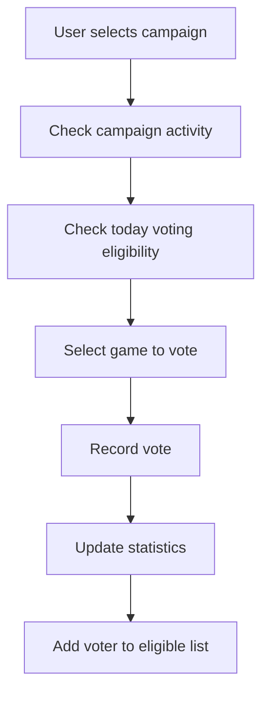

# 🎮 BAG Guild - Game Voting System

<div align="center">


**Smart and Fair Game Voting System with Daily Draw Mechanics**

[](https://soliditylang.org/)
[](https://openzeppelin.com/)
[](https://opensource.org/licenses/MIT)

[العربية](README-ar.md) | **English**

</div>

## 🌟 About BAG Guild

**BAG Guild** is a leading organization in gaming and decentralized technologies, aiming to build an advanced community of players and developers. We believe in the power of technology to develop the gaming industry and create unique user experiences.

### 🎯 Our Vision
- **Transparency**: Open-source and transparent voting system
- **Fairness**: Fair weighted draw mechanism based on participation
- **Community**: Building a strong community of gaming enthusiasts
- **Innovation**: Using cutting-edge blockchain technologies

## 🚀 About the Project

### 📋 Description

This project is a **Smart Game Voting System** built on blockchain technology, allowing users to:

- 🗳️ **Daily Voting**: One vote per day per campaign
- 🎮 **Game Campaigns**: Create multi-game voting campaigns  
- 🎁 **Prize Draws**: Fair weighted drawing system based on vote count
- 📊 **Transparent Tracking**: Complete tracking of all votes and results
- 🔒 **Security**: Using OpenZeppelin security standards

### 🛠️ Tech Stack

- **Solidity ^0.8.22** - Smart contract programming language
- **OpenZeppelin Upgradeable** - Security standards and upgradeability
- **UUPS Proxy Pattern** - Safe upgrade pattern
- **NatSpec Documentation** - Comprehensive code documentation

## 🏗️ System Architecture

### 📦 Core Components

```
🎮 Game Management
├── Add Games
├── Update Game Info  
└── Manage Prize Types

🗳️ Campaign Management  
├── Create Voting Campaigns
├── Manage Campaign Periods
└── Link Games with Prizes

👥 Voting System
├── Daily Voting
├── Voter Tracking
└── Prevent Double Voting

🎁 Winner Selection
├── Determine Winning Game
├── Weighted Random Draw
└── Announce Results
```

### 🔄 Voting Mechanism



## 📱 How to Use

### 👑 For Admins

```solidity
// Add new game
addGame("Game Name", "Description", "imageUrl", "bannerUrl", PrizeType.CASH);

// Create voting campaign
createVotingCampaign(
    "Campaign Name",
    "Description", 
    [1, 2, 3], // game IDs
    ["Prize 1", "Prize 2", "Prize 3"], // prizes
    startTime,
    endTime
);

// Draw winners after campaign ends
drawWinners(campaignId, numberOfWinners);
```

### 👤 For Users

```solidity
// Vote for game in campaign
voteForGame(campaignId, gameId);

// Check today's voting eligibility
canVoteToday(userAddress, campaignId);

// View total votes
getUserTotalVotes(userAddress, campaignId);
```

### 📊 For Queries

```solidity
// View campaign details
getCampaign(campaignId);

// View active campaigns
getActiveCampaigns();

// View winners
getCampaignWinners(campaignId);
```

## 🎲 Random Draw System

### ⚖️ Weighted Mechanism

The system uses **weighted random drawing** where:

- 🔢 **More votes = Better odds**: Each additional vote increases winning probability
- 🎯 **Absolute fairness**: Results cannot be manipulated
- 🔄 **No repetition**: Winners cannot win twice in the same draw

**Example**: If Ahmed votes 5 times and Ali votes once:
- Ahmed's winning chance = 5/6 (83.33%)
- Ali's winning chance = 1/6 (16.67%)

### 🔒 Security

```solidity
// Using secure pseudo-random (for development)
generateRandomNumber(totalWeightedVotes, nonce);

// For production: Recommended to use Chainlink VRF
```

## 📈 Advanced Features

### 🕐 Daily Voting
- ✅ One vote per day per user per campaign
- ⏰ Day calculation based on Unix timestamp
- 📅 Track last voting day for each user

### 📊 Comprehensive Tracking
- 👥 List of all voters for each game
- 📈 Detailed statistics for each user
- 🎯 Vote tracking for each game in each campaign

### 🔄 Upgradeability
- 🛡️ UUPS Proxy Pattern for safe upgrades
- 🔒 Protection from unauthorized upgrades
- 📝 Complete documentation for each version

## 🔧 Installation & Deployment

### 📋 Prerequisites

```bash
# Node.js & npm
node --version  # >= 16.0.0
npm --version   # >= 8.0.0

# Hardhat
npm install --global hardhat
```

### ⚙️ Installation

```bash
# Clone the project
git clone https://github.com/BAGGuild/game-voting-system.git
cd game-voting-system

# Install dependencies
npm install

# Setup environment variables
cp .env.example .env
# Edit .env with your values
```

### 🚀 Deployment

```bash
# Compile contracts
npx hardhat compile

# Run tests
npx hardhat test

# Deploy to local network
npx hardhat run scripts/deploy.js --network localhost

# Deploy to Sepolia Testnet
npx hardhat run scripts/deploy.js --network sepolia
```

## 🧪 Testing

```bash
# Run all tests
npx hardhat test

# Tests with code coverage
npx hardhat coverage

# Gas tests
npx hardhat test --gas-reporter
```

## 📚 Documentation

### 📖 NatSpec Documentation
The contract includes comprehensive documentation using NatSpec:

```solidity
/**
 * @title GameVoting
 * @dev A smart contract for managing game voting campaigns
 * @notice This contract allows users to vote for games in campaigns
 * @author BAG Guild Team
 */
```

### 🔍 Contract Verification

The contract can be verified on:
- **Etherscan**: For mainnet
- **Sepolia Etherscan**: For testnet

## 🤝 Contributing

We welcome your contributions! 🎉

### 📝 How to Contribute

1. **Fork** the project
2. Create a **feature branch** (`git checkout -b feature/AmazingFeature`)
3. **Commit** your changes (`git commit -m 'Add some AmazingFeature'`)
4. **Push** to the branch (`git push origin feature/AmazingFeature`)
5. Open a **Pull Request**

### 🐛 Bug Reports

Please use [GitHub Issues](https://github.com/BAGGuild/contracts/issues) to report:
- 🐞 Bugs and issues
- 💡 Enhancement suggestions
- 🔧 Feature requests

## 🛡️ Security

### 🔒 Security Standards
- ✅ OpenZeppelin Contracts
- ✅ Access Control
- ✅ Reentrancy Protection
- ✅ Safe Math Operations

### 🚨 Security Reporting

If you discover a security vulnerability, please do not open a public issue. Instead:
- 📧 Email us at: security@bagguild.com
- 🔐 Use PGP encryption if possible

## 📄 License

This project is licensed under the MIT License - see the [LICENSE](LICENSE) file for details.

```
MIT License

Copyright (c) 2025 BAG Guild

Permission is hereby granted, free of charge, to any person obtaining a copy
of this software and associated documentation files (the "Software"), to deal
in the Software without restriction...
```

## 🌐 Important Links

- 🏠 **Official Website**: [https://bagguild.com](https://bagguild.com)
- 📱 **Dapp**: [https://app.bagguild.com](https://dapp.bagguild.com)
- 🐦 **Twitter**: [@BAGGuild](https://twitter.com/BAGGuild)
- 💬 **Discord**: [BAG Guild Discord](https://discord.gg/BAGGuild)
- 📘 **Documentation**: [https://docs.bagguild.com](https://docs.bagguild.com)

## 🙏 Acknowledgments

- 💙 **OpenZeppelin** for excellent security standards
- 🔧 **Hardhat** for advanced development environment
- 🌟 **BAG Guild Community** for support and contributions
- 🎮 **Game Developers** who trust our system

## 📊 Statistics

<div align="center">


**🎯 Our Vision: A Better Future for Gaming with Decentralized Technology**

</div>

---

<div align="center">

**Made with ❤️ by BAG Guild Team**

</div> 